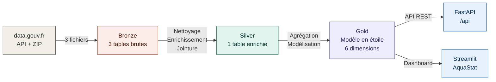
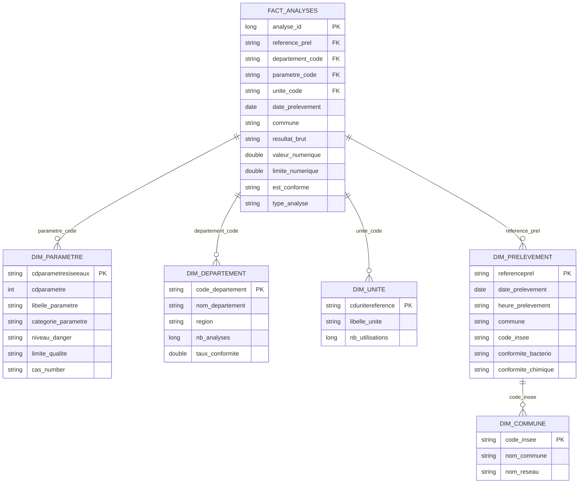
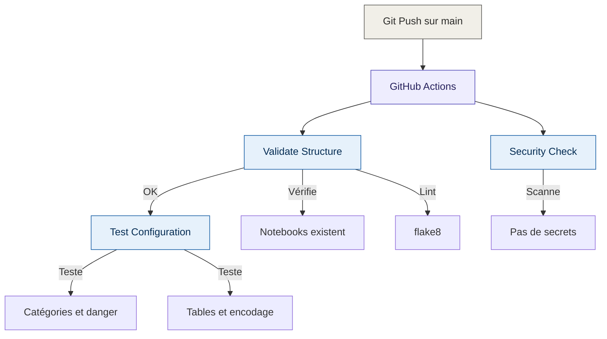

# Water Quality Pipeline

Pipeline de données pour l'analyse de la qualité de l'eau distribuée en France — de l'ingestion brute jusqu'au dashboard interactif.

## Dashboard AquaStat

Interface de visualisation déployée sur Streamlit Cloud, connectée en temps réel à Databricks.

**Fonctionnalités :**

- 6 KPIs en temps réel : taux de conformité, non-conformités, analyses, prélèvements, communes, paramètre le plus défaillant
- Carte choroplèthe interactive par département (filtre non-conformités uniquement)
- Jauge de conformité nationale avec zones de couleur par tier (Optimal / Satisfaisant / Insuffisant / Critique)
- Analyse approfondie des communes : histogramme de distribution + scatter plot volume vs conformité + recherche par nom
- Tendance mensuelle avec ligne de régression sur axe secondaire
- Filtre par année et filtre non-conformités
- Export CSV des données filtrées
- Méthodologie & sources de données intégrées

## Architecture du pipeline

## Modèle en étoile (Gold)

## Pipeline CI/CD

## Sources de données

| Fichier | Description | Volume |
|---------|-------------|--------|
| DIS_RESULT_2024.txt | Résultats d'analyses | 12.6M lignes |
| DIS_PLV_2024.txt | Prélèvements (dates, communes) | 408K lignes |
| DIS_COM_UDI_2024.txt | Communes et réseaux | 49K lignes |

Source : [data.gouv.fr](https://www.data.gouv.fr/fr/datasets/resultats-du-controle-sanitaire-de-leau-distribuee-commune-par-commune/)

## Stack technique

| Couche | Technologie |
|--------|-------------|
| Cloud & traitement | Azure / Databricks (Serverless), PySpark |
| Stockage | Delta Lake (architecture médaillon Bronze → Silver → Gold) |
| API | FastAPI + Uvicorn |
| Dashboard | Streamlit Cloud |
| CI/CD | GitHub Actions + semantic-release |
| Qualité | Great Expectations |

## Structure du projet

    water-quality-pipeline/
    ├── .github/
    │   └── workflows/
    │       └── ci.yml
    ├── api/
    │   ├── main.py
    │   ├── requirements.txt
    │   └── README.md
    ├── dashboard/
    │   ├── streamlit_app.py
    │   └── requirements.txt
    ├── notebooks/
    │   ├── 01_DLT_Ingestion_Qualite_Eau.py
    │   ├── 02_Silver_Transformation.py
    │   ├── 03_Gold_Agregations.py
    │   └── 04_Quality_Checks.py
    ├── config/
    │   └── pipeline_config.py
    ├── tests/
    │   └── test_pipeline.py
    ├── .gitignore
    ├── LICENSE
    └── README.md

## Catégories de paramètres

| Catégorie | Exemples | Volume |
|-----------|----------|--------|
| Pesticides | Atrazine, Glyphosate, Métolachlore | 6.2M |
| Microbiologie | E. coli, Entérocoques | 1.5M |
| Organoleptique | Turbidité, Odeur, Couleur | 1.5M |
| Physico-chimique | pH, Conductivité, Température | 1.3M |
| Désinfection | Chlore, Trihalométhanes | 830K |
| Nitrates/Nitrites | NO3, NO2, Ammonium | 524K |
| Métaux et minéraux | Plomb, Arsenic, Aluminium | 461K |
| Chimie minérale | Sulfates, Fluorures | 157K |
| Radioactivité | Tritium, Activité alpha/béta | 74K |

## Résultats clés

- **99,72 %** de taux de conformité national (2024)
- 28 140 non-conformités détectées sur 12,6M analyses
- 17 543 prélèvements avec au moins une non-conformité
- Données couvrant toute l'année 2024 (2 jan – 31 déc)
- 34 811 communes et 101 départements analysés
- 4 niveaux de danger : Sanitaire critique, Sanitaire, Organoleptique, Surveillance

## Conventions de commits

- `feat:` nouvelle fonctionnalité
- `fix:` correction de bug
- `docs:` documentation
- `test:` ajout de tests
- `ci:` modifications CI/CD
- `refactor:` restructuration de code

## Auteur

Mariam Douamba — Projet réalisé dans le cadre d'une formation Data Engineering chez Simplon.co (2026).
