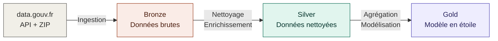
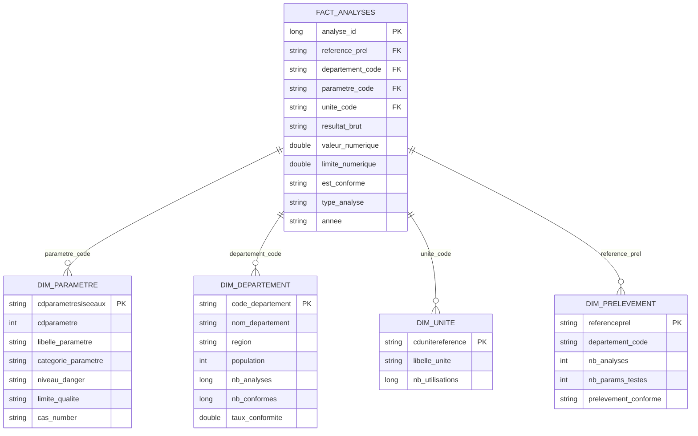
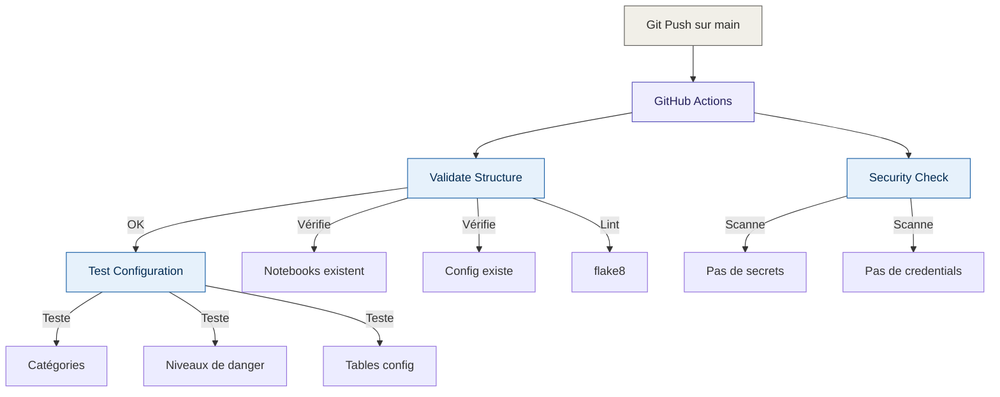

# Water Quality Pipeline

Pipeline de données pour l'analyse de la qualité de l'eau distribuée en France.

## Architecture du pipeline

## Modèle en étoile (Gold)

## Pipeline CI/CD

## Source de données

- **Dataset** : [Résultats du contrôle sanitaire de l'eau](https://www.data.gouv.fr/fr/datasets/resultats-du-controle-sanitaire-de-leau-distribuee-commune-par-commune/)
- **Volume** : 12.6 millions d'analyses (2024)
- **Couverture** : 101 départements français

## Stack technique

- **Cloud** : Azure / Databricks (Serverless)
- **Traitement** : PySpark
- **Stockage** : Delta Lake (architecture médaillon)
- **CI/CD** : GitHub Actions
- **Qualité** : Great Expectations

## Structure du projet

    water-quality-pipelines/
    ├── .github/
    │   └── workflows/
    │       └── ci.yml                             # Pipeline CI/CD (3jobs)
    ├── notebooks/
    │   ├── 01_DLT_Ingestion_Qualite_Eau.py        # Bronze : ingestion API
    │   ├── 02_Silver_Transformation.py            # Silver : nettoyage
    │   └── 03_Gold_Agregations.py                 # Gold : modèle en étoile
    ├── config/
    │   └── pipeline_config.py                     # Configuration centralisée  
    ├── tests/
    │   └── test_pipeline.py                       # Tests unitaires 
    ├── .gitignore
    ├── LICENSE
    └── README.md

## Catégories de paramètres

| Catégorie | Exemples | Volume |
|-----------|----------|--------|
| Pesticides | Atrazine, Glyphosate, Métolachlore | 6.2M |
| Microbiologie | E. coli, Entérocoques | 1.5M |
| Organoleptique | Turbidité, Odeur, Couleur | 1.5M |
| Physico-chimique | pH, Conductivité, Température | 1.3M |
| Désinfection | Chlore, Trihalométhanes | 830K |
| Nitrates/Nitrites | NO3, NO2, Ammonium | 524K |
| Métaux et minéraux | Plomb, Arsenic, Aluminium | 461K |
| Chimie minérale | Sulfates, Fluorures | 157K |
| Radioactivité | Tritium, Activité alpha/béta | 74K |

## Résultats clés

- 28 140 non-conformités détectées sur 12.6M analyses
- 17 543 prélèvements avec au moins une non-conformité (sur 291 604)
- Taux de conformité moyen : environ 99%
- 4 niveaux de danger : Sanitaire critique, Sanitaire, Organoleptique, Surveillance

## Conventions de commits (Semantic Release)

- `feat:` nouvelle fonctionnalité
- `fix:` correction de bug
- `docs:` documentation
- `test:` ajout de tests
- `ci:` modifications CI/CD
- `refactor:` restructuration de code

## Auteur

Projet réalisé dans le cadre d'une formation Data Engineering.
